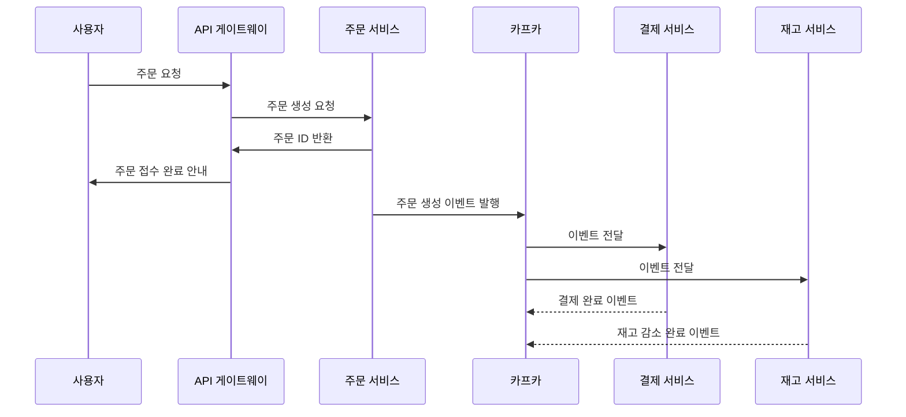

# API 게이트웨이 vs. 카프카: 역할 차이와 협업 방식

API 게이트웨이와 카프카는 마이크로서비스 아키텍처에서 각각 다른 목적을 가진 핵심 구성 요소이다.

둘 다 요청/응답 또는 이벤트 흐름을 다루지만, 방식과 위치, 목적은 뚜렷하게 다르다.

---

## API 게이트웨이란?

API 게이트웨이는 클라이언트(웹/앱)의 요청을 받아 인증, 인가, 라우팅, 속도 제한 등을 처리한 뒤

해당 요청을 적절한 마이크로서비스로 **즉시 전달**하는 역할을 한다.

요청을 "받아서 줄을 세우는" 것이 아니라, "바로 안내"하고 "응답을 기다려 전달"하는 흐름이다.

- 비유: 안내 데스크. 고객이 오면 목적에 맞는 창구로 바로 안내함
- 처리 방식: 동기
- 기능: 인증, 로드밸런싱, 라우팅, 트래픽 제어, 보안 등
- 예시: 사용자가 주문 요청 → API 게이트웨이 → 주문 서비스 호출 → 주문 ID 응답

---

## 카프카란?

카프카는 마이크로서비스 간 이벤트 메시지를 **비동기적으로 주고받는 메시지 브로커**이다.

특정 서비스가 이벤트를 카프카에 발행하면, 관련된 여러 서비스가 해당 이벤트를 각자 필요한 시점에 소비한다.

이 과정은 "줄을 서서 차례로 처리하는" 것과 유사하다.

- 비유: 대기표 시스템. 메시지를 차례로 꺼내 쓰는 방식
- 처리 방식: 비동기
- 기능: 메시지 저장, 이벤트 브로커, 장애 내성, 소비자 분산 처리
- 예시: 주문 서비스가 주문 생성 이벤트를 발행 → 결제, 재고, 알림 서비스가 각자 소비하여 후속 작업 수행

---

## 실제 흐름 예시

---

## 역할 비교

| 항목 | API 게이트웨이 | 카프카 |
| --- | --- | --- |
| 비유 | 안내 데스크, 교통정리 | 대기표 시스템, 우편함 |
| 처리 방식 | 동기 (요청 → 응답) | 비동기 (발행 → 소비) |
| 주요 위치 | 클라이언트 ↔ 서비스 사이 | 서비스 ↔ 서비스 사이 |
| 기능 | 인증, 라우팅, 로드밸런싱, 속도 제한 등 | 이벤트 저장, 큐잉, 멀티 소비, 장애 대응 |
| 줄 세우기 | X (요청은 즉시 전달) | O (메시지를 큐에 저장 후 순차 처리) |

---

## 다양한 실무 예시

- 배달 앱: 사용자는 주문 후 바로 응답을 받지만, 라이더 매칭, 음식 준비, 알림 발송은 카프카를 통해 비동기 처리함
- SNS: 게시글 작성 요청은 동기로 처리되지만, 알림 발송, 추천 시스템 반영 등은 카프카를 통해 나중에 처리됨

---

## 결론

- API 게이트웨이는 **요청을 받고 즉시 라우팅하는 안내 데스크**이다
- 카프카는 **비동기 메시지를 큐에 쌓고, 각 서비스가 순차적으로 처리하는 대기열**이다
- 둘은 서로 다르지만 함께 사용될 때 가장 강력한 아키텍처를 구성한다

> 요약하자면,
> 
> - "줄을 세우는 건 카프카고, API 게이트웨이는 줄을 세우지 않고 안내만 한다"는 설명이 더 정확하다.
> 
> 하나는 동기, 하나는 비동기. 목적도 위치도 역할도 분명히 다르다.
>