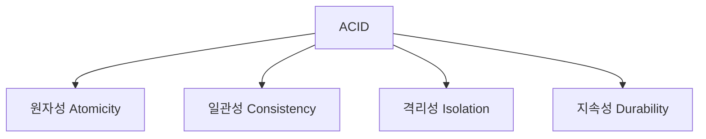

# 데이터베이스 트랜잭션
> 💡 데이터베이스의 데이터를 조작하는 작업의 논리적 단위
>

---

## 📚 정의

트랜잭션은:

- 🔄 데이터베이스 작업의 완전성을 보장하는 기능
- 🧩 여러 개의 작업을 하나의 논리적 단위로 묶어 처리

---

## 🎯 트랜잭션의 특징 (ACID)

1. **원자성(Atomicity)** ⚛️
    - 트랜잭션 내 모든 연산의 성공적 완료 또는 전체 실패
2. **일관성(Consistency)** 🔄
    - 트랜잭션 실행 전후 데이터베이스 상태의 일관성 유지
3. **격리성(Isolation)** 🔒
    - 동시 실행 트랜잭션 간 상호 영향 방지
4. **지속성(Durability)** 💾
    - 완료된 트랜잭션 결과의 영구적 반영

---

## 🛠️ 트랜잭션 관리 방식

### 1. 선언적 트랜잭션 관리 📝

- 주로 어노테이션(@Transactional) 사용
- 비즈니스 로직과 트랜잭션 처리 로직 분리
- 코드 가독성 및 유지보수성 향상

### 2. 프로그래밍적 트랜잭션 관리 💻

- 개발자가 직접 트랜잭션 경계 설정 및 관리
- 세밀한 트랜잭션 제어 필요 시 사용

---

## 🔄 트랜잭션 상태

1. 활성(Active) 상태 ▶️
2. 부분적으로 커밋(Partially Committed) 상태 🔜
3. 커밋(Committed) 상태 ✅
4. 실패(Failed) 상태 ❌
5. 중단(Aborted) 상태 🛑
6. 종료(Terminated) 상태 🏁

---

## ⚙️ 트랜잭션 속성

1. **전파 행위(Propagation)** 🔀
    - 기존 트랜잭션과의 관계 정의
2. **격리 수준(Isolation Level)** 🔒
    - 동시 실행 트랜잭션 간 격리 정도 설정
3. **타임아웃(Timeout)** ⏱️
    - 트랜잭션의 최대 실행 시간 설정
4. **읽기 전용(Read-only)** 👀
    - 트랜잭션의 데이터 변경 없음 명시

---

> 🌟 TIP: 트랜잭션 관리는 데이터의 일관성과 무결성을 보장하는 중요한 메커니즘이다. 특히 금융 거래, 전자상거래, 재고 관리 등 데이터의 정확성이 중요한 시스템에서 필수적이다.
>