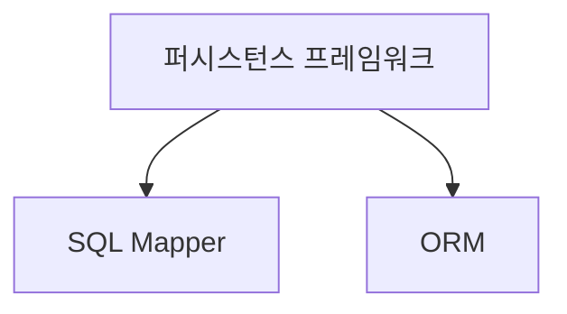

# 퍼시스턴스 프레임워크 (Persistence Framework)
## 정의 🔍

퍼시스턴스 프레임워크는 데이터의 영속성을 관리하기 위한 소프트웨어 프레임워크

- 데이터베이스와 연동되는 시스템을 빠르게 개발하고 안정적인 구동을 보장해주는 도구

## 목적 🎯

- 데이터의 저장, 조회, 변경, 삭제를 다루는 클래스 및 설정 파일들의 집합 제공
- JDBC 프로그래밍의 복잡함과 번거로움 해소

## 주요 기능 ⚙️

1. **데이터 매핑** 🔗
    - 애플리케이션의 데이터 구조를 DB의 테이블과 매핑
2. **데이터베이스 연동** 🌐
    - DB 연결, SQL 쿼리 실행, 결과 매핑 등의 작업 관리
3. **트랜잭션 및 캐시 관리** 💾
    - 데이터 일관성과 성능 최적화 지원

## 종류 🔀

1. **SQL Mapper** 📝
    - SQL 문장으로 직접 DB 데이터를 다룸
    - 예: MyBatis
2. **ORM (Object-Relational Mapping)** 🔄
    - 자바 객체를 통해 간접적으로 DB 데이터를 다룸
    - 예: Hibernate, JPA

## 포함 관계 🎯

- SQL Mapper는 퍼시스턴스 프레임워크의 한 종류
- 퍼시스턼스 프레임워크는 크게 SQL Mapper와 ORM으로 분류



```
퍼시스턴스 프레임워크SQL MapperHibernate(ORM), MyBatis(SQL Mapper), JPA 등MyBatis,iBatis
```

## 장점 👍

- 개발 시간 단축
- 코드의 재사용성 증가
- 데이터베이스 독립성 제공

## 대표적인 예 🌟

1. **MyBatis**
    - SQL 매퍼 프레임워크
    - 개발자가 지정한 SQL, 저장프로시저 등을 지원
2. **Hibernate**
    - JPA의 구현체
    - ORM 프레임워크

## 퍼시스턴스 프레임워크의 중요성 💡

- 데이터베이스 작업을 추상화하고 단순화
- 개발자가 비즈니스 로직에 더 집중할 수 있게 해주는 중요한 도구

## 선택 시 고려사항 🤔

1. **프로젝트 복잡도**
    - 단순한 프로젝트: SQL Mapper (예: MyBatis)
    - 복잡한 도메인 모델: ORM (예: Hibernate)
2. **성능 요구사항**
    - 고도의 SQL 최적화 필요: SQL Mapper
    - 일반적인 CRUD 작업 중심: ORM
3. **학습 곡선**
    - SQL Mapper가 일반적으로 더 낮은 학습 곡선
    - ORM은 더 높은 추상화 수준으로 인해 학습에 더 많은 시간 소요 가능
4. **유지보수성**
    - ORM이 일반적으로 더 높은 유지보수성 제공
    - SQL의 변경이 잦은 경우 SQL Mapper가 유리할 수 있음
5. **데이터베이스 독립성**
    - ORM이 더 높은 수준의 데이터베이스 독립성 제공