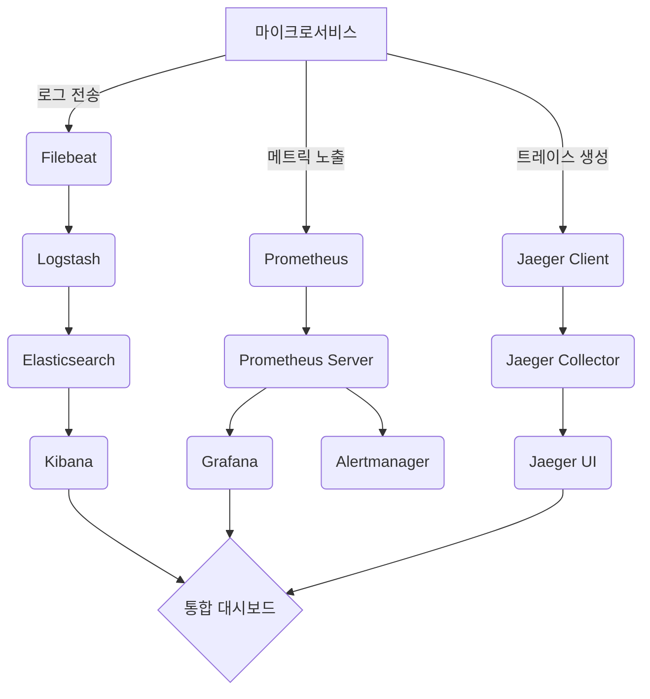

# Logging & Monitoring System Architecture
## 1. **ELK Stack (로그 관리)**

**역할**: 분산된 로그를 중앙 집중화해 분석

**컴포넌트**:

- **Filebeat**: 서비스별 로그 수집 (예: `auth-service.log`, `payment-service.log`)
- **Logstash**: 로그 포맷 통일 (예: JSON 형식 변환, IP 주소 마스킹)
- **Elasticsearch**: 로그 저장 및 검색 최적화 (예: "500 에러" 발생 로그 검색)
- **Kibana**: 대시보드 제공 (예: 시간별 에러 로그 추이 시각화)

**예시**:

사용자 로그인 실패 이슈 발생 → Kibana에서 `auth-service` 로그 필터링 → 실패 원인(잘못된 토큰 생성 로직) 발견

## 2. **Prometheus + Grafana (메트릭 모니터링)**

**역할**: 실시간 시스템 상태 모니터링 및 알림

**컴포넌트**:

- **Prometheus**: 메트릭 수집 (예: CPU 사용률 80% 도달)
- **Grafana**: 사용자 정의 대시보드 (예: API 응답 시간 그래프)
- **Alertmanager**: 슬랙/이메일 알림 전송 (예: 디스크 사용량 90% 초과 시 경고)

**예시**:

결제 서비스 지연 발생 → Grafana에서 API Latency 대시보드 확인 → Redis 캐시 응답 시간 급증 발견

## 3. **Jaeger (분산 트레이싱)**

**역할**: 마이크로서비스 간 요청 흐름 추적

**컴포넌트**:

- **Jaeger Client**: 각 서비스에 트레이스 데이터 생성 (예: 요청 ID `trace-id:1234`)
- **Jaeger Collector**: 트레이스 데이터 수집
- **Jaeger UI**: Gantt 차트로 시각화 (예: `order-service` → `payment-service` 호출 지연 확인)

**예시**:

주문 처리 지연 → Jaeger에서 `order-service` 트레이스 확인 → `inventory-service` 호출에서 2초 지연 발견

## 전체 시스템 연동 플로우 (Mermaid)

## 핵심 연동 포인트

1. **ELK ↔ Prometheus/Grafana**
    - Grafana가 Elasticsearch를 데이터 소스로 연결 → 로그와 메트릭을 단일 대시보드에서 확인 가능

      (예: 에러 로그 증가와 CPU 사용률 상승 동시 분석)

2. **Jaeger ↔ Prometheus**
    - 트레이스 데이터에 메트릭 라벨 추가 → 특정 트레이스의 리소스 사용량 확인 가능

      (예: 지연된 요청의 메모리 사용량 분석)

3. **Alertmanager ↔ 슬랙/이메일**
    - Prometheus 알림 규칙 기반으로 즉각적인 대응 가능

      (예: 5분 내 500 에러 100회 발생 시 DevOps 팀에 알림)

## 실제 구현 시 주의사항

- **로그 포맷 표준화**: 모든 서비스가 `JSON + 공통 필드(trace-id, service-name)` 형식 사용
- **메트릭 라벨링**: `env=prod`, `region=kr` 등 운영 환경 정보 추가
- **트레이스 샘플링**: 전체 트래픽의 10%만 수집해 저장 비용 절감
- **권한 분리**: Kibana/Grafana/Jaeger UI 접근 권한을 팀별로 차등 부여