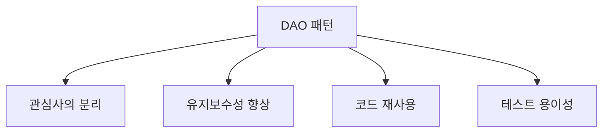

# DAO 패턴
> 💡 데이터베이스 접근을 추상화하는 소프트웨어 디자인 패턴
>

---

## 📚 정의

DAO 패턴은:

- 🔍 데이터베이스나 기타 영속성 메커니즘에 대한 추상 인터페이스 제공
- 🧩 소프트웨어 설계의 데이터 접근 계층을 구현하는 객체지향 디자인 패턴

---

## ✨ 주요 특징

1. 🔀 데이터 접근 로직과 비즈니스 로직의 분리
2. 🕶️ 데이터베이스 상세 구현을 숨기는 추상화된 인터페이스 제공
3. 📦 CRUD(Create, Read, Update, Delete) 연산의 캡슐화
4. 🔓 특정 데이터베이스 기술에 종속되지 않는 코드 작성 가능성

---

## 👍 장점



- **관심사의 분리** 🎯
    - 비즈니스 로직과 데이터 접근 로직의 명확한 책임 구분
- **유지보수성 향상** 🛠️
    - 데이터 접근 방식 변경 시 비즈니스 로직 영향 최소화
- **코드 재사용** ♻️
    - DAO 인터페이스를 통한 다양한 구현체의 쉬운 교체
- **테스트 용이성** 🧪
    - Mock DAO를 활용한 비즈니스 로직 테스트 간소화

---

## 💻 구현 예시

```java
// DAO 인터페이스
public interface UserDAO {
    User getUser(int id);
    void saveUser(User user);
    void updateUser(User user);
    void deleteUser(int id);
}

// DAO 구현체
public class UserDAOImpl implements UserDAO {
// JDBC, JPA 등을 사용한 실제 데이터베이스 연산 구현
}

// 비즈니스 로직
public class UserService {
    private UserDAO userDAO;

    public UserService(UserDAO userDAO) {
        this.userDAO = userDAO;
    }

    public void processUserData(int userId) {
        User user = userDAO.getUser(userId);
// 비즈니스 로직 처리
    }
}
```

---

> 🌟 TIP: DAO 패턴을 사용하면 데이터 접근 계층을 효과적으로 추상화하여 유연하고 확장 가능한 애플리케이션 아키텍처를 구축할 수 있다.
>