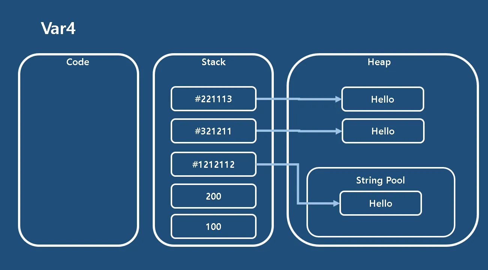
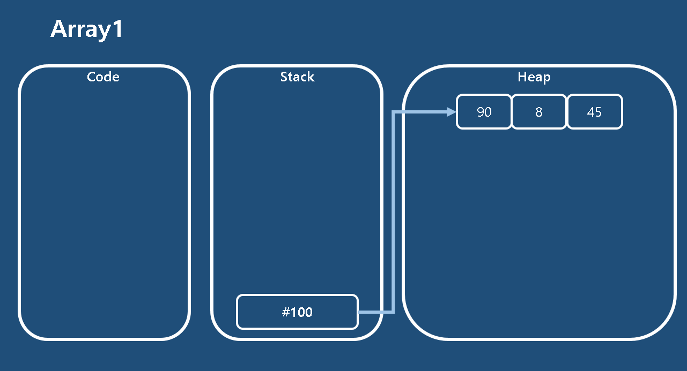
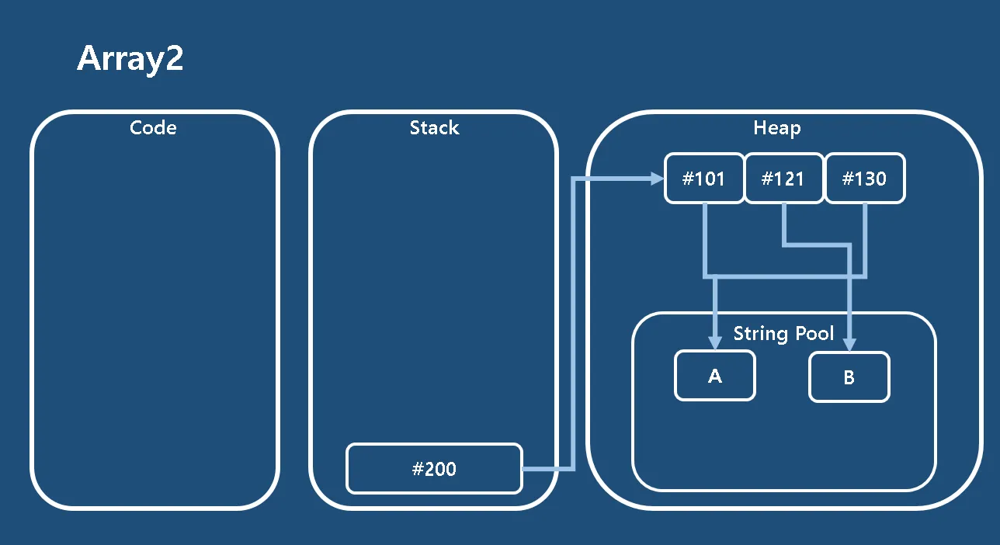
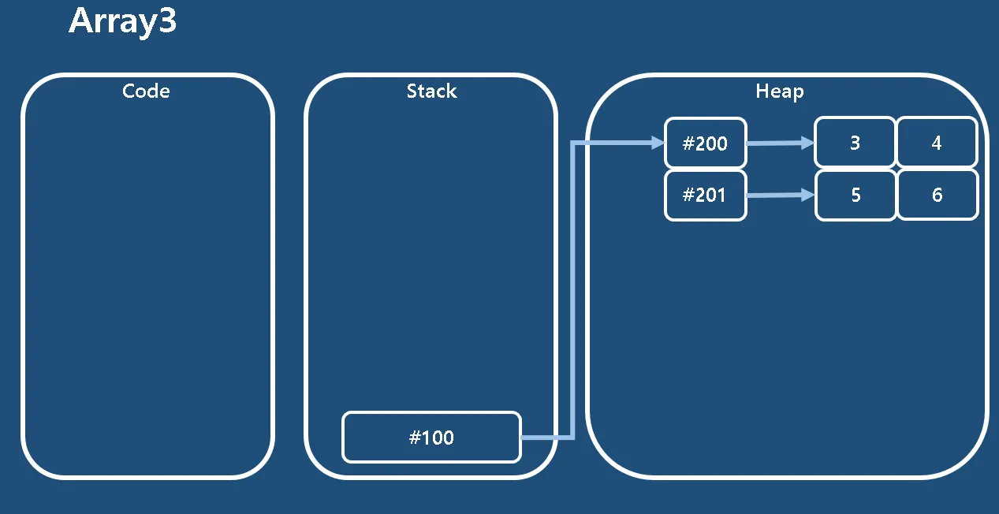

# Java 메모리 구조
## **주요 영역**

- Code 영역
- Data 영역
- Stack 영역
- Heap 영역

## **Code 영역**

- 실행할 프로그램의 코드 저장
- CPU가 명령어를 순차적으로 가져와 처리
- 프로그램 시작부터 종료까지 메모리에 유지

## **Stack 영역**

- 함수 호출 관련 지역 변수와 매개변수 저장
- 후입선출(LIFO) 방식으로 동작
- 함수 호출 시 할당, 완료 시 소멸
- 컴파일 타임에 크기 결정
- 높은 주소에서 낮은 주소 방향으로 할당

## **Heap 영역**

- 프로그래머가 직접 메모리 할당/해제하는 영역
- 동적 할당을 위한 영역
- 런타임 시 크기 결정
- 낮은 주소에서 높은 주소 방향으로 할당
- malloc(), new 연산자로 할당, free(), delete 연산자로 해제

## **특징**

- 프로그램 실행 시 운영체제가 메모리에 로드
- 각 영역이 상호작용하며 프로그램 실행에 기여

# 실습 코드

```java
public class Var4 {
    public static void main(String[] args) {
        // Stack 메모리: 변수 'a'에 정수 값 100이 저장됨
        int a = 100;

        // Stack 메모리: 변수 'b'에 정수 값 200이 저장됨
        int b = 200;

        // Stack 메모리: 변수 'result'에 a와 b의 합인 300이 저장됨
        int result = a + b;

        // result 값을 출력
        System.out.println(result);

        // Heap 메모리: "Hello" 문자열 리터럴이 상수 풀(Constant Pool)에 저장됨
        // Stack 메모리: 변수 'str'에 상수 풀에 있는 "Hello"의 참조값이 저장됨
        String str = "Hello";

        // str 값을 출력
        System.out.println(str);

        // Heap 메모리: new 키워드로 새로운 "Hello" 객체가 생성됨
        // Stack 메모리: 변수 'str2'에 이 새로 생성된 "Hello" 객체의 참조값이 저장됨
        String str2 = new String("Hello");

        // str2 값을 출력
        System.out.println(str2);
    }
}

```


```java
package array;

import java.util.Arrays;
import java.util.Random;

public class Array1 {
    public static void main(String[] args) {
        // Stack 메모리: 배열 참조 변수 'a'가 생성되고, 
        // Heap 메모리: 크기 3의 int 배열이 생성됨
        int[] a = new int[3];

        // Stack 메모리: random 객체 참조 변수가 생성되고,
        // Heap 메모리: Random 객체가 생성됨
        Random random = new Random();

        // 배열 'a'의 각 요소에 1부터 100 사이의 난수를 할당
        for (int i = 0; i < a.length; i++) {
            // a[i]는 스택 메모리의 'a'가 참조하는 힙 메모리의 배열 요소를 가리킴
            a[i] = random.nextInt(100) + 1;
        }

        // 배열의 내용을 문자열로 출력
        System.out.println(Arrays.toString(a));

        // 배열의 각 요소를 순차적으로 출력
        for (int i = 0; i < a.length; i++) {
            System.out.println(a[i]);
        }

        // 향상된 for문을 이용하여 배열의 각 요소를 순차적으로 출력
        for (int n : a) {
            System.out.println(n);
        }
    }
}

```


```java
package array;

public class Array2 {
    public static void main(String[] args) {
        // Stack 메모리: 배열 참조 변수 's'가 생성되고,
        // Heap 메모리: 크기 3의 String 배열이 생성됨
        String[] s = new String[3];

        // Stack -> Heap: s[0]이 "A"를 참조 (String Pool에 저장)
        s[0] = "A";

        // Stack -> Heap: s[1]이 "B"를 참조 (String Pool에 저장)
        s[1] = "B";

        // Stack -> Heap: s[2]이 "A"를 참조 (s[0]과 동일한 String Pool의 객체를 참조)
        s[2] = "A";

        // 배열 객체 자체의 참조값을 출력 (배열의 해시코드 출력)
        System.out.println(s);

        // Stack 메모리: StringBuffer 객체의 참조 변수 'sb'가 생성되고,
        // Heap 메모리: StringBuffer 객체가 생성됨
        StringBuffer sb = new StringBuffer();

        // 배열 's'의 각 요소를 순차적으로 출력
        for (String str : s) {
            // 각 배열 요소의 값을 출력 ("A", "B", "A" 순서)
            System.out.println(str);
        }
    }
}

```


```java
package array;

import java.util.Arrays;
import java.util.Random;

public class Array3 {
    public static void main(String[] args) {
        // Stack 메모리: 2차원 배열 참조 변수 'a'가 생성됨
        // Heap 메모리: 크기 5x5의 2차원 int 배열이 생성됨
        int[][] a = new int[5][5];

        // Stack 메모리: Random 객체의 참조 변수 'random'이 생성되고,
        // Heap 메모리: Random 객체가 생성됨
        Random random = new Random();

        // 배열의 각 요소에 1 ~ 100 사이의 랜덤한 숫자를 할당
        for (int i = 0; i < a.length; i++) {
            for (int j = 0; j < a[i].length; j++) {
                // a[i][j]는 스택 메모리의 'a'가 참조하는 힙 메모리의 배열 요소를 가리킴
                a[i][j] = random.nextInt(100) + 1;
            }
        }

        // 배열의 내용을 행 단위로 출력
        for (int[] n : a) { // 1차원 배열 'n'은 스택 메모리의 'a'가 참조하는 힙 메모리의 각 행을 가리킴
            for (int num : n) { // 각 행에서 개별 요소를 출력
                System.out.printf("[%d]", num);
            }
            System.out.println(); 
        }
        
        System.out.println("------------------------");

        // 2차원 배열 전체를 문자열로 변환하여 출력
        // Arrays.deepToString()은 다차원 배열의 모든 요소를 포함한 문자열을 반환함
        System.out.println(Arrays.deepToString(a));
    }
}

```
