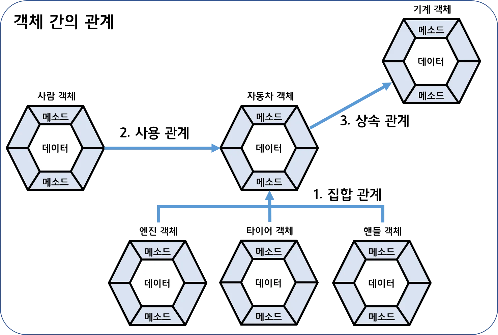

# 객체지향 프로그래밍이란?
- OOP: Object Oriented Programming
- 부품 객체를 먼저 만들고 하나씩 조립해 완성된 프로그램을 만드는 기법

## 객체(Object)란?

- 물리적으로  존재하는 것(자동차, 책, 사람)
- 추상적인 것(회사, 날짜) 중에서 자신의 속성과 동작을 가지는 모든 것
- 객체는 필드(속성)과 메서드(동작)로 구성된 자바 객체로 모델링 가능
- 소프트웨어 인티그레이션

## **사용 목적**

1. 복잡한 현실 세계를 프로그램으로 모델링
2. 코드의 재사용성 향상
3. 유지보수의 용이성 증대
4. 직관적이고 인간 친화적인 코드 작성

## **주요 특징**

객체지향 프로그래밍의 4가지 핵심 특징:

1. **추상화**: 공통적인 속성과 기능을 추출하여 정의
2. **캡슐화**: 데이터와 해당 데이터를 처리하는 메소드를 하나의 단위로 묶음
3. **상속**: 기존 클래스의 속성과 메소드를 새로운 클래스가 재사용
4. **다형성**: 같은 이름의 메소드가 다른 기능을 수행할 수 있도록 함

## **장점**

1. **코드 재사용성**: 상속을 통해 기존 코드를 효율적으로 재사용 가능
2. **유지보수 용이성**: 객체 단위로 모듈화되어 있어 특정 부분만 수정하기 쉬움
3. **확장성**: 기존 코드를 변경하지 않고 새로운 기능을 추가 가능
4. **신뢰성**: 캡슐화를 통해 데이터를 보호하고 오류를 줄일 수 있음

## **단점**

1. **설계의 복잡성**: 객체 간의 관계를 설계하는 것이 복잡할 수 있음
2. **실행 속도**: 절차지향 프로그래밍에 비해 상대적으로 실행 속도가 느릴 수 있음
3. **학습 곡선**: 객체지향 개념을 이해하고 적용하는 데 시간이 필요
4. **크기**: 객체와 클래스로 인해 프로그램 크기가 커질 수 있음

## **구성 요소**

1. **클래스**: 객체의 설계도 역할을 하며, 속성(필드)과 기능(메소드)을 정의
2. **객체**: 클래스의 인스턴스로, 실제로 메모리에 할당된 실체
3. **메소드**: 객체의 기능을 구현하는 코드 블록
4. **필드**: 객체의 상태를 나타내는 변수

## 객체 간의 관계

- 객체 지향 프로그램에서는 객체는 다른 객체와 관계를 맺음
- 관계의 종류
    - 집합 관계: 완성품과 부품의 관계
    - 사용 관계: 객체가 다른 객체를 사용하는 관계
    - 상속 관계: 종류 객체와 구체적인 사물 객체 관계

## **클래스 (Class)**

- **정의**: 클래스는 객체를 생성하기 위한 설계도 또는 틀
- 클래스는 객체가 가져야 할 속성(필드)과 기능(메소드)을 정의
- **특징**:
    - 클래스는 논리적 엔터티로, 객체의 구조와 동작 방식을 결정
    - 클래스 자체로는 메모리 공간을 할당하지 않으며, 객체를 생성하기 위한 청사진 역할

## **클래스와 객체의 관계**

- **인스턴스화**: 클래스로부터 객체를 생성하는 과정을 인스턴스화라고 함. 클래스는 객체를 정의하고, 객체는 클래스의 인스턴스가 됨
- **설계도와 제품**: 클래스와 객체의 관계는 제품의 설계도와 실제 제품의 관계와 유사. 설계도(클래스) 없이는 제품(객체)을 만들 수 없음

## **객체 지향 프로그래밍과 절차 지향 프로그래밍 비교**
### **절차 지향 프로그래밍**

### **특징**

- 순차적인 처리 중심
- 프로그램 전체가 유기적으로 연결된 구조
- 컴퓨터의 처리 구조와 유사한 접근 방식

### **장점**

- 빠른 실행 속도
- 간단한 프로그램 작성의 용이성
- 컴퓨터 처리구조와의 유사성

### **단점**

- 유지보수의 어려움
- 코드 재사용의 한계
- 대규모 프로젝트에서의 복잡성

### **객체 지향 프로그래밍**

### **특징**

- 객체 중심의 설계
- 추상화, 캡슐화, 상속, 다형성의 개념
- 실제 세계를 모델링한 접근 방식

### **장점**

- 코드의 재사용성
- 유지보수의 용이성
- 대규모 프로젝트에 적합한 구조
- 직관적이고 인간 친화적인 코드 작성 가능성

### **단점**

- 상대적으로 느린 처리 속도
- 설계 시 많은 시간과 노력 필요성
- 소규모 프로젝트에서의 과도한 복잡성

### **주요 차이점**

- 코드와 데이터의 관계
- 프로그램 구조의 설계 방식
- 문제 해결 접근법
- 유지보수와 확장성에 대한 고려 정도